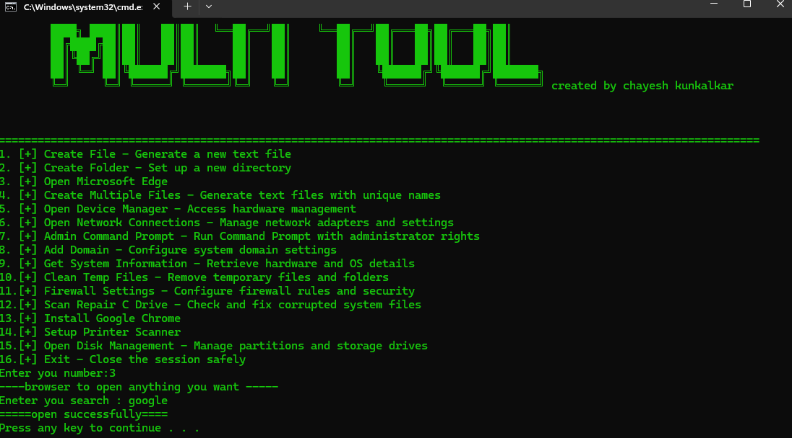

# 🖥️ Windows System Operations Batch Script

This repository contains a batch file menu tool that allows users to perform common Windows system operations quickly and easily.  
The script is interactive, user-friendly, and designed for administrative and educational purposes.

---

## 📋 Features

The batch file provides the following options:

1. [+] Create File – Generate a new text file  
2. [+] Create Folder – Set up a new directory  
3. [+] Open Microsoft Edge – Launch the Edge browser  
4. [+] Create Multiple Files – Generate text files with unique names  
5. [+] Open Device Manager – Access hardware management  
6. [+] Open Network Connections – Manage network adapters and settings  
7. [+] Admin Command Prompt – Run Command Prompt with administrator rights  
8. [+] Add Domain – Configure system domain settings  
9. [+] Get System Information – Retrieve hardware and OS details  
10. [+] Clean Temp Files – Remove temporary files and folders  
11. [+] Firewall Settings – Configure firewall rules and security  
12. [+] Scan & Repair C Drive – Check and fix corrupted system files  
13. [+] Install Google Chrome – Run Chrome setup from local installer  
14. [+] Setup Printer & Scanner – Configure printing and scanning devices  
15. [+] Open Disk Management – Manage partitions and storage drives  
16. [+] Exit – Close the session safely  

---

## 🚀 Usage

1. Clone or download this repository.  
2. Run as administrator the batch file (`.bat`) on your Windows system.  
3. Enter the number corresponding to the task you want to perform.
--- 

##Example image
---

---
 
